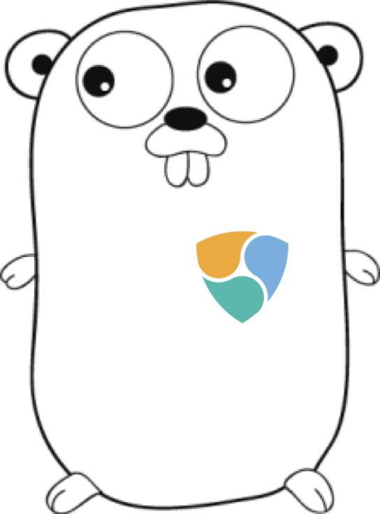

# nemgo

A pure golang SDK for the Nem blockchain.

This project is in it's infancy and looking for more contributors! If you are working in Go, are interested in blockchain technologies, or just want to join a friendly open source project you are welcome!

## Getting Started

`go get` the package using the following command:

```bash
$ go get github.com/myndshft/nemgo
```

Open up your favorite text editor, create a new `Client` and interact with the blockchain!

```go
package main

import (
    "fmt"
    "log"

    "github.com/myndshft/nemgo"
)

// testnet = byte(0x98)

// nemgo.New() will default to a sensible NIS on the mainnet

func main() {
    c, err := nemgo.New()
    if err != nil {
        log.Fatal(err)
    }

    // Custom Client
    c, err := nemgo.New(nemgo.WithNIS("MY.CUSTOM.NIS.HOST:7890", byte(0x68)))
    if err != nil {
        log.Fatal(err)
    }

    // Get account information
    address = "YOUR ACCOUNT ADDRESS"
    actInfo, err := c.AccountInfo(address)
    if err != nil {
        log.Fatal(err)
    }
    fmt.Println(actInfo)

    // Get the current height of the chain
    height, err := c.Height()
    if err != nil {
        log.Fatal(err)
    }
    fmt.Println(height)

    // Subscribe to transactions related to an account
    // This will return a go channel
    txs, err := c.SubscribeUnconfirmedTX(address)
    if err != nil {
        log.Fatal(err)
    }
    defer close(txs)
    for tx := range txs {
        fmt.Println(tx)
    }
```

## Helping out

Check out the `CONTRIBUTING.md` documents in the `docs` folder. We always welcome any contribution, large or small!

_The gopher logo is the work of Renee French. The Nem logo is licensed under CC0 1.0_
